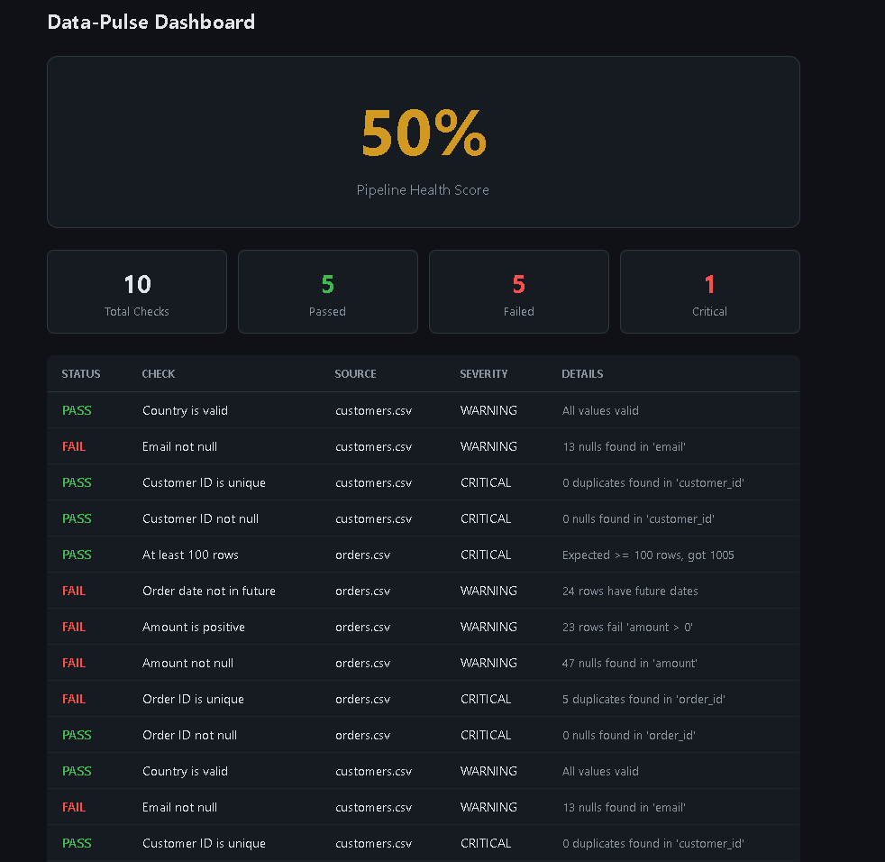
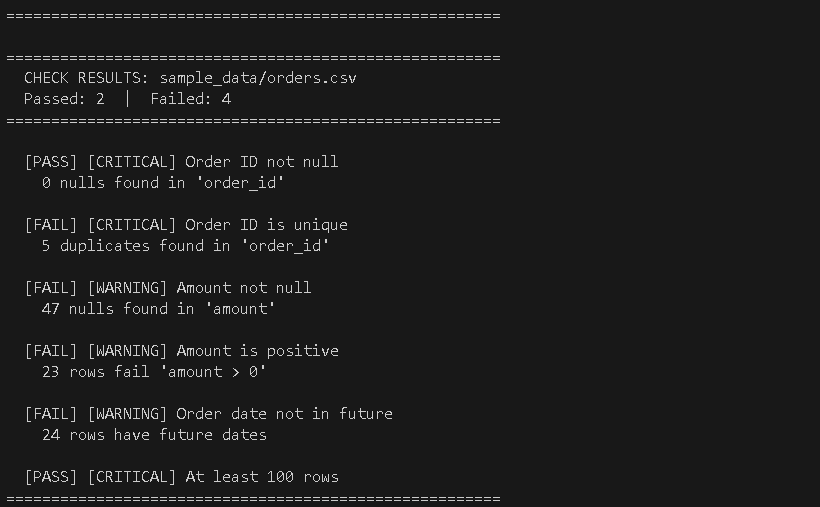

<div align="center">

```
    ██████╗  █████╗ ████████╗ █████╗       ██████╗ ██╗   ██╗██╗     ███████╗███████╗
    ██╔══██╗██╔══██╗╚══██╔══╝██╔══██╗      ██╔══██╗██║   ██║██║     ██╔════╝██╔════╝
    ██║  ██║███████║   ██║   ███████║█████╗██████╔╝██║   ██║██║     ███████╗█████╗  
    ██║  ██║██╔══██║   ██║   ██╔══██║╚════╝██╔═══╝ ██║   ██║██║     ╚════██║██╔══╝  
    ██████╔╝██║  ██║   ██║   ██║  ██║      ██║     ╚██████╔╝███████╗███████║███████╗
    ╚═════╝ ╚═╝  ╚═╝   ╚═╝   ╚═╝  ╚═╝      ╚═╝      ╚═════╝ ╚══════╝╚══════╝╚══════╝
```

**Catch silent data pipeline failures before your stakeholders do.**

[](https://python.org)
[](https://fastapi.tiangolo.com)
[](https://docker.com)
[](LICENSE)
[](https://slack.com)

[Quick Start](#-quick-start) · [Features](#-features) · [Architecture](#-architecture) · [Configuration](#-configuration)

</div>

---

## The Problem

Bad data costs companies **$12.9 million per year** ([Gartner](https://www.gartner.com/en/data-analytics/topics/data-quality)). Most data quality issues don't throw errors - they silently corrupt: null values creep into critical columns, duplicate records pile up, stale data gets served to dashboards, and nobody notices until the CEO asks *"why does this number look wrong?"*

## The Solution

**Data-Pulse** is a lightweight, open-source data quality engine that:

1. **Profiles** your datasets automatically - row counts, null rates, distributions, data types
2. **Runs checks** defined in simple YAML - no Python required to add new rules
3. **Detects anomalies** using statistical methods (z-scores) against historical baselines
4. **Alerts your team** on Slack the moment something breaks
5. **Displays health** on a real-time dashboard - green, yellow, red at a glance

One command. Zero config databases. Works on CSV, Parquet, or any SQL source.

---

## Screenshots

<div align="center">

### Dashboard
*Pipeline health at a glance - overall score, pass/fail breakdown, check details*



<br/><br/>

### Slack Alerts
*Real-time notifications with severity routing - critical vs warning*


<br/><br/>

### Terminal Output
*Detailed check results with PASS/FAIL status and severity levels*



</div>

---

## Quick Start

### Option A: Docker (Recommended)
```bash
git clone https://github.com/MuditNautiyal-21/Data-Pulse.git
cd Data-Pulse
docker-compose up --build
```
Open **http://localhost:8000/dashboard** - done.

### Option B: Local Python
```bash
git clone https://github.com/MuditNautiyal-21/Data-Pulse.git
cd Data-Pulse

# Setup
python -m venv venv
source venv/bin/activate        # Windows: venv\Scripts\activate
pip install -r requirements.txt

# Generate sample data
python sample_data/generate_data.py

# Run all checks
python run.py

# Launch dashboard
uvicorn api.main:app --reload
```
Open **http://localhost:8000/dashboard**

---

## Features

### YAML-Defined Checks - No Code Required
```yaml
checks:
  - name: "Order ID is unique"
    type: unique_check
    column: order_id
    severity: critical

  - name: "Amount is positive"
    type: value_check
    column: amount
    condition: "> 0"
    severity: warning
```
Anyone on your team can add quality rules without writing Python. Just edit a YAML file.

### 6 Built-in Check Types

| Check Type | What It Catches | Example |
|:---|:---|:---|
| `null_check` | Missing values | *"order_id should never be empty"* |
| `unique_check` | Duplicate records | *"customer_id must be unique"* |
| `value_check` | Out-of-range values | *"amount must be > 0"* |
| `accepted_values_check` | Invalid categories | *"status must be completed, pending, shipped, or cancelled"* |
| `freshness_check` | Stale or future dates | *"order_date should not be in the future"* |
| `row_count_check` | Missing data loads | *"table must have at least 100 rows"* |

### Auto-Profiling
Every run automatically profiles each data source:
- Row and column counts
- Null rates per column
- Unique value counts
- Min / Max / Mean for numeric columns
- Data type detection

### Statistical Anomaly Detection
Data-Pulse stores profile history in SQLite and uses **z-score analysis** to detect when today's data deviates significantly from the baseline. If your `amount` column usually has 2% nulls but today it's 15% - Data-Pulse flags it.

### Slack Alerts with Severity Routing
Failed checks trigger Slack notifications automatically:
- 🔴 **Critical** failures - things that should never happen (duplicate primary keys, missing IDs)
- 🟡 **Warning** failures - things to investigate (null emails, negative amounts)

### Real-Time Dashboard
A dark-themed web dashboard showing:
- **Pipeline Health Score** - single percentage showing overall data quality
- **Pass/Fail/Critical** stats at a glance
- **Check results table** - sortable, with severity badges and failure details
- Auto-refreshes every 30 seconds

---

## Architecture

```
                        ┌─────────────────┐
                        │   config.yaml   │
                        │  + checks/*.yaml│
                        └────────┬────────┘
                                 │
                                 ▼
         ┌───────────────────────────────────────────┐
         │              DataPulse Engine             │
         │                                           │
         │  ┌──────────┐  ┌──────────┐  ┌─────────┐  │
         │  │ Profiler  │→│  Check   │→ │ Anomaly │  │
         │  │          │  │  Runner  │  │ Detector│  │
         │  └──────────┘  └──────────┘  └─────────┘  │
         │                                           │
         └──────────────────┬────────────────────────┘
                            │
                ┌───────────┼───────────┐
                ▼           ▼           ▼
         ┌──────────┐ ┌──────────┐ ┌──────────┐
         │  SQLite  │ │  Slack   │ │  FastAPI │
         │ Storage  │ │  Alerts  │ │  + Dash  │
         └──────────┘ └──────────┘ └──────────┘
              │                         │
              │    Historical Data      │    http://localhost:8000
              │    & Trend Analysis     │    /dashboard
              ▼                         ▼
```

**Data flows in one direction:**
1. **Config** defines sources and check rules
2. **Profiler** scans every column and records statistics
3. **Check Runner** evaluates each YAML rule against the data
4. **Anomaly Detector** compares current profile to historical baselines
5. **Results** are stored in SQLite, pushed to Slack, and displayed on the dashboard

---

## Project Structure

```
Data-Pulse/
├── engine/
│   ├── __init__.py
│   ├── profiler.py          # Auto-profiles data sources
│   ├── check_runner.py      # Executes YAML-defined checks
│   ├── storage.py           # SQLite persistence layer
│   ├── anomaly.py           # Z-score anomaly detection
│   └── alerts.py            # Slack webhook integration
├── api/
│   ├── __init__.py
│   └── main.py              # FastAPI server + dashboard route
├── checks/
│   ├── orders_checks.yaml   # Check rules for orders table
│   └── customers_checks.yaml
├── sample_data/
│   ├── generate_data.py     # Creates demo data with intentional issues
│   ├── orders.csv           # 1005 orders (5% null amounts, duplicates)
│   └── customers.csv        # 200 customers (8% null emails)
├── templates/
│   └── dashboard.html       # Real-time health dashboard
├── tests/
│   └── __init__.py
├── run.py                   # Main entry point — runs everything
├── config.yaml              # Source definitions + alert config
├── requirements.txt
├── Dockerfile
├── docker-compose.yaml
└── README.md
```

---

## ⚙ Configuration

### Adding a New Data Source

Edit `config.yaml`:
```yaml
sources:
  my_new_table:
    type: csv
    path: path/to/your/data.csv
    description: "Description of this source"
```

### Writing a New Check

Create a YAML file in `checks/`:
```yaml
source: path/to/your/data.csv

checks:
  - name: "Revenue is positive"
    type: value_check
    column: revenue
    condition: "> 0"
    severity: critical
```

### Enabling Slack Alerts

1. Create a [Slack Incoming Webhook](https://api.slack.com/messaging/webhooks)
2. Update `config.yaml`:
```yaml
alerts:
  slack:
    enabled: true
    webhook_url: "https://hooks.slack.com/services/YOUR/WEBHOOK/URL"
```

---

## Tech Stack

| Technology | Role |
|:---|:---|
| **Python 3.11** | Core engine, profiling, anomaly detection |
| **FastAPI** | REST API serving dashboard and check results |
| **SQLite** | Zero-config metadata storage and history tracking |
| **Pandas** | Data loading, profiling, and analysis |
| **SciPy** | Statistical anomaly detection (z-scores) |
| **PyYAML** | Human-readable check definitions |
| **Docker** | One-command deployment |
| **Slack Webhooks** | Real-time alerting |

---

## Roadmap

- [ ] PostgreSQL / MySQL source connectors
- [ ] Schema change detection
- [ ] Email alerts
- [ ] Custom SQL check support
- [ ] Airflow DAG for scheduled runs
- [ ] Profile trend charts on dashboard
- [ ] GitHub Actions CI/CD pipeline
- [ ] CLI tool (`datapulse check --source orders`)

---

## Contributing

Contributions are welcome. To get started:

1. Fork the repository
2. Create a feature branch (`git checkout -b feature/your-feature`)
3. Commit your changes (`git commit -m 'Add your feature'`)
4. Push to the branch (`git push origin feature/your-feature`)
5. Open a Pull Request

---

## License

This project is licensed under the MIT License - use it however you want.

---

<div align="center">

**Built by [Mudit Nautiyal](https://github.com/MuditNautiyal-21)**

If this helped you, consider giving it a ⭐

</div>